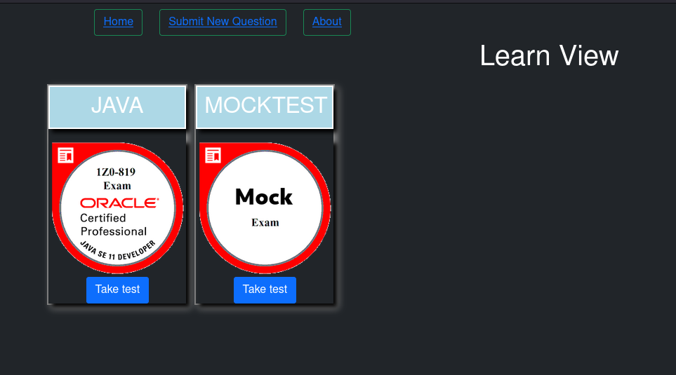

# Intro

Learn View is more about learning than getting certified

# How to use it


Fire up app: 

```
$ git clone 
$ cd learnview
$ docker-compose build
$ docker-compose up 
```

Start testing your skills at http://localhost:8080

## shots




# How to help

You don't need to code to help, you can provide new questions for our exams (or even a new one).

So far we have these exams:

- Java 11 exam (1Z0-819) 
- MockTest (internal usage for unit test)

All questions are in "*\learnview-api\load\*" folder. 

You can edit a JSON file yourself or use "Submit New Question" option. 


# How to code this project

## Architecture

* Database - MongoDB
* API - Spring Boot
* Front end - Vue JS

## How it works

When the API is up, the first job is to load all questions from  "*\learnview-api\load\*" folder into the database.

And then you are free to navigate and take your test.  


## Suggested tools

* Database - Robo 3t for  MongoDB
* API - Spring Tools Suite for Spring Boot
* Front end - VS Code for Vue JS

## Before coding

Please take a look at available issues, there are some job that need to be done. 


